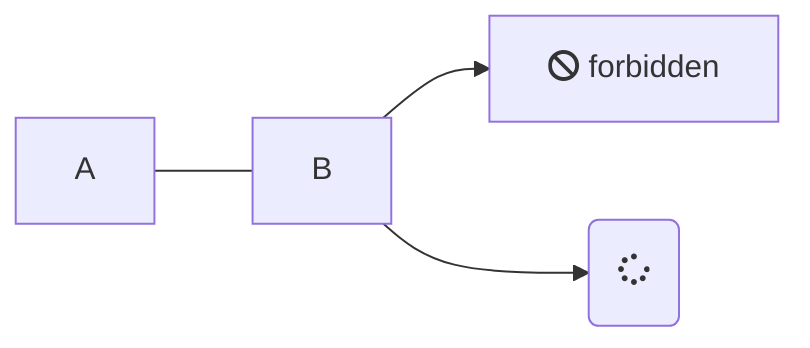

# title 1
this is content. title 1 is maximum.

## title 2
section 2. [跳转到 链接](#链接)
* first line.
* second line.
```
### title 3
#### title 4
##### title 5
###### title 6
```
### title 3
#### title 4
##### title 5
###### title 6
title 6 is minimum.

## 段落
* `*`的用法
  - 一个`*` *a 斜体*
  - 二个`**` **bb 加粗**
  - 三个`***` ***ccc 斜体 加粗***
    - 我是第三级
* 删除线
  + 二个`~~` ~~ddd 删除~~
    * 我也是第三级
* 其他
  1. 一个 \` 包含内容，重点突出 `aaa`
  2. html标签 ```<u>下划线内容</u>``` <u>下划线</u>
    + 我也是第三级
* 区块
几级几个`>`
```
> 区块引用
> > 第二级
> > > 第三块
```
> 区块引用
> > 第二级
> > > 第三块

## 代码块
\`\`\`  
content.  
\`\`\`  

```
copy me
```

## 链接
* named link [baidu](https://baidu.com/)
* direct link https://baidu.com
* anchor link [current page title 2](#title-2)
  用横线 `-` 替换空格 ` `
* file link [test.md](/test.md)

### title 3.2
* image 1  
```

```


* image 2  


* image html 1  
```

```


* image html 2  
```

```


## 分割线
* 方法1 `***`
***
* 方法2 `* * *`
* * *
* 方法3 `*****`
*****
* 方法4 `- - -`
- - -
* 方法5 `----------`
----------

## 表格
```
| 左对齐 | 右对齐 | 居中对齐 |
| :-----| ----: | :----: |
| 格 | 格2 | 格3 |
| a | b | c |
| 单元格 | 单元格 | 单元格 |
```

| 左对齐 | 右对齐 | 居中对齐 |
| :-----| ----: | :----: |
| 格 | 格2 | 格3 |
| a | b | c |
| 单元格 | 单元格 | 单元格 |

## html 标签
* 键盘 ```<kbd>Ctrl</kbd>```
使用 <kbd>Ctrl</kbd>+<kbd>Alt</kbd>+<kbd>Del</kbd> 重启电脑
* 转义字符 ``` \ ```
```
\\ \` \* \#
more: \ ` * _ { } [ ] ( ) # + - . !
```
\` \* \# \[ \(  

* render mermaid diagrams


* 公式1
```
$...$ or \(...\)
$f(x)=sin(x)+12$
```
$f(x)=sin(x)+12$
 
* 公式2
```
$$...$$ or \[...\] or ```match```
$\sum_{n=1}^{100} n$
```
$\sum_{n=1}^{100} n$

$$
\begin{Bmatrix}
   a & b \\
   c & d
\end{Bmatrix}
$$

```match
\begin{CD}
   A @>a>> B \\
@VbVV @AAcA \\
   C @= D
\end{CD}
```

## enjoy it
end
